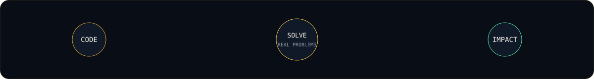

<div align="center">



<br />

### I engineer dependable digital products for education, business, and African scale.

<p>
  Full-Stack Product Engineer &nbsp;•&nbsp; Founder &nbsp;•&nbsp; Educator<br />
  Based in Lagos, Nigeria
</p>

[](https://awofesobipeaceportfolio.netlify.app/)
[](https://eduvate.com.ng)
[](https://linkedin.com/in/peace-kolade-58a27a314)
[](mailto:awofesobipeace@gmail.com)

</div>

---

## About me

I’m **Awofesobi Peace Kolade** — also known as **CODEMaster** — a first-class Electrical & Electronic Engineering graduate, full-stack product engineer, teacher, and founder.

I turn difficult real-world workflows into software people can trust. My work spans system architecture, backend logic, databases, interface design, mobile applications, deployment, and the final details that make a product genuinely usable in production.

```text
DESIGN THE SYSTEM  →  BUILD THE CORE  →  SHIP THE EXPERIENCE  →  MEASURE THE IMPACT
```



## What I’m focused on

```yaml
building: EDUVATE CBT — AI-powered assessment and learning infrastructure
teaching: Grade 6–8 programming and software development
mentoring: Developers through CODEMaster Academy
exploring: Trustworthy AI, mobile learning, and resilient SaaS architecture

principle: "Ship deliberately. Measure honestly. Refine relentlessly."
```

## Flagship product — EDUVATE CBT

> **An integrated education operating system — not another quiz app.**

EDUVATE CBT brings institutional computer-based testing, an LMS, AI-supported practice, analytics, mobile learning, assignments, live classes, anti-malpractice tooling, bulk onboarding, and intelligent explanations into one coordinated workflow.

I built the product end to end: database architecture, exam engine, dashboards, APIs, notifications, deployment, and its React Native companion app.

| Product signal | Details |
|---|---|
| **Status** | In production |
| **Role** | Founder / Lead Engineer |
| **Core stack** | PHP · Laravel · MySQL · JavaScript · React Native · Expo · FCM · AI workflows |
| **Surfaces** | Institutional tools · Web practice hub · Mobile learning app |

<p align="center">
  <a href="https://eduvate.com.ng"></a>
  <a href="https://play.google.com/store/apps/details?id=com.eduvate.practicehub"></a>
  <a href="https://www.youtube.com/@EduvateCBT"></a>
</p>

## Selected work

<table>
<tr>
<td width="50%" valign="top">

### 🌿 Woods Heritage

AgriTech investment platform with cinematic motion, trust-led product design, and a premium green-and-gold visual system.

`GSAP` `JavaScript` `PHP`

[View live project →](https://www.woodsheritage.com.ng/)

</td>
<td width="50%" valign="top">

### 🍽️ G&P Kitchen

UK food-ordering and catering platform with a mobile-first purchasing and event-booking experience.

`PHP` `MySQL` `JavaScript`

[View live project →](https://gnpkitchen.co.uk/)

</td>
</tr>
<tr>
<td width="50%" valign="top">

### 🤝 True Match Online

Privacy-first matrimonial technology with guardian participation and Sharia-compliant matching flows.

`PHP` `MySQL` `JavaScript`

[View live project →](https://www.truematchonline.com)

</td>
<td width="50%" valign="top">

### 💼 Career Elevate

Recruitment infrastructure connecting candidates and employers through filtering, applications, and secure administration.

`Bootstrap` `PHP` `MySQL`

[View live project →](https://careerelevate.org)

</td>
</tr>
<tr>
<td width="50%" valign="top">

### 🏙️ The Southwest Realtor

Property discovery and conversion system with a custom CMS and context-aware WhatsApp lead handoff.

`jQuery` `PHP` `MySQL`

[View live project →](https://www.thesouthwestrealtor.com)

</td>
<td width="50%" valign="top">

### 🏠 Landlady NG

Agent-facing property marketplace built around structured listings and qualified WhatsApp conversations.

`Bootstrap` `PHP` `MySQL`

[View live project →](https://www.yourlandladyng.com)

</td>
</tr>
</table>

<p align="center">
  <a href="https://github.com/CODEMASTER-284?tab=repositories"></a>
</p>

## Engineering toolkit

| Area | Tools and practices |
|---|---|
| **Frontend** | JavaScript · React · HTML · CSS · Bootstrap · Tailwind · GSAP |
| **Backend** | PHP · Laravel · REST APIs · Authentication · Background jobs |
| **Data** | MySQL · Relational modelling · Migrations · Reporting queries |
| **Mobile** | React Native · Expo · Push notifications · Offline-aware flows |
| **Infrastructure** | Linux · Nginx · Cloudflare · Hostinger VPS · Netlify · Vercel |
| **Engineering practice** | Git · GitHub · Security hardening · Testing · Technical writing |

<p align="center">
  
  
  
  
  
  
  
  
  
</p>

## GitHub activity

<div align="center">


<picture>
  <source media="(prefers-color-scheme: dark)" srcset="https://raw.githubusercontent.com/CODEMASTER-284/CODEMASTER-284/output/github-contribution-grid-snake-dark.svg" />
  <source media="(prefers-color-scheme: light)" srcset="https://raw.githubusercontent.com/CODEMASTER-284/CODEMASTER-284/output/github-contribution-grid-snake.svg" />
  
</picture>

<sub>THE GRAPH ISN’T THE WORK. IT’S THE TRACE THE WORK LEAVES BEHIND.</sub>

</div>

## Beyond the build

I don’t only ship software — I teach the thinking behind it.

- **CODEMaster Academy:** structured mentorship for developers building practical confidence.
- **Coding education:** programming and software development for Grade 6–8 learners.
- **Technical writing:** lessons from PHP security, product engineering, and client work.
- **Developer content:** concise learning resources on [TikTok](https://www.tiktok.com/@codemaster284), [Medium](https://medium.com/@awofesobipeace), and [YouTube](https://www.youtube.com/channel/UCG_QqBUgEMB76jm1RcpNr7w).

---

<div align="center">

## Let’s build something meaningful

I’m open to **high-impact engineering roles**, **product collaborations**, **EdTech partnerships**, and **select full-stack builds**.

[](mailto:awofesobipeace@gmail.com)
[](https://linkedin.com/in/peace-kolade-58a27a314)
[](https://medium.com/@awofesobipeace)

<br />

<sub>AWOFESOBI PEACE KOLADE · CODEMASTER · LAGOS, NIGERIA</sub>

</div>
